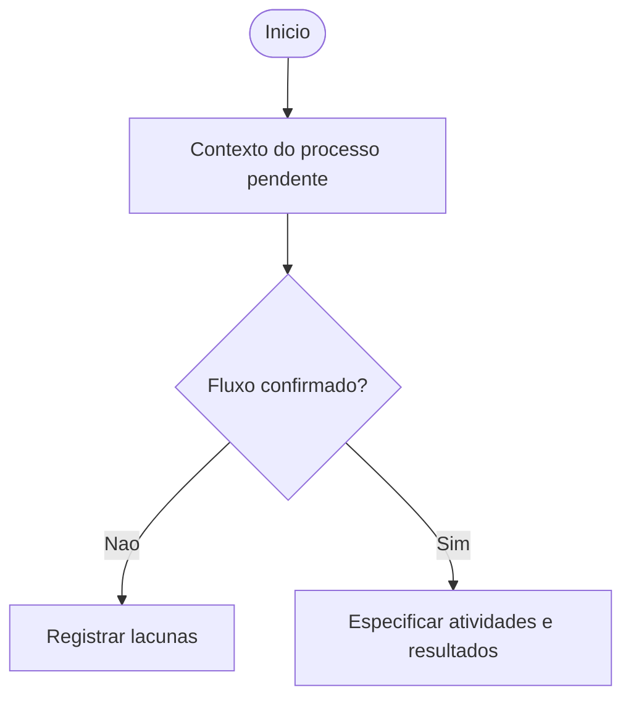
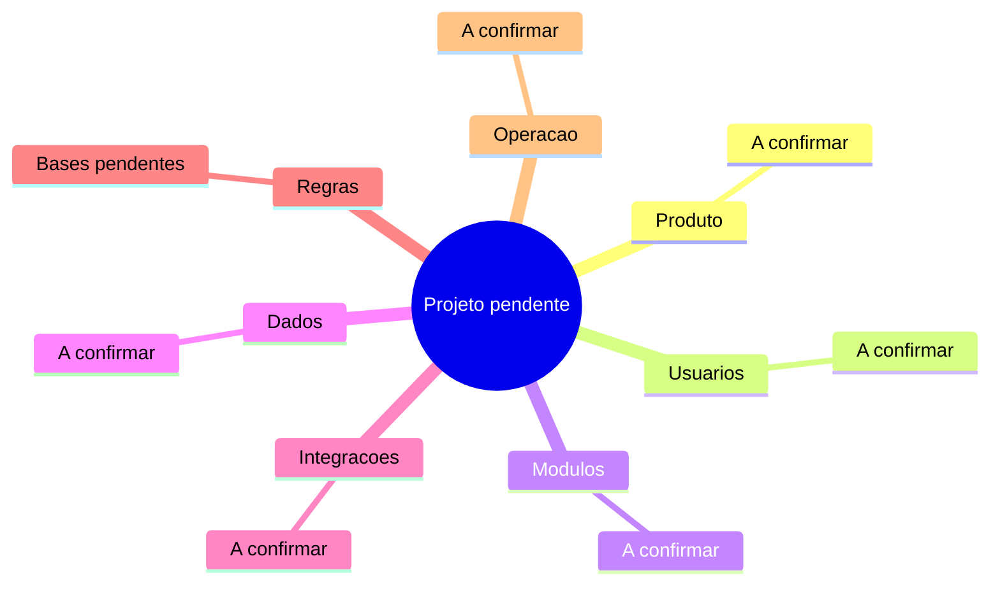

## Identificação e controle

Registrar identificação, revisão, data real, responsável e fase sem inventar valores.

## Resumo executivo

Explicar problema, solução, público, valor e limites com fonte.

## Visão de produto

Objetivos, indicadores, perfis, jornadas, MVP, prioridades e exclusões; fonte principal referenciada.

## Mapa funcional

Funcionalidades com IDs estáveis, módulos, entradas/saídas, regras e dependências.

## Visão de engenharia

Componentes, responsabilidades, stack confirmada, integrações e decisões.

## Dados e conceitos

Entidades, ciclo de vida e glossário com fontes.

## Fluxos

Diagramas propostos abaixo representam apenas lacunas; substituir por fluxo sustentado, decisões, resultados e erros conhecidos. Identificar negócio versus desenvolvimento e anexar fonte e descrição textual.

Descrição textual: o fluxo real não foi fornecido; deve ser confirmado antes de representar atividades. Fonte: pendente. Este é um marcador de descoberta, não fluxo de negócio confirmado.

Descrição textual: as sete áreas aguardam contexto e aplicabilidade. Fonte: pendente. Sintaxe/renderização a verificar.

## Orientações para uso

Procedimento: ID, objetivo, público, pré-condições, passos conhecidos, resultado, exceções, fonte e estado de validação. Sem interface não inventar passos.

## Falhas e suporte

Mensagens conhecidas, significado, ação permitida e encaminhamento; ausência registrada como pendência.

## Operação

Implantação, monitoração, manutenção e recuperação ou N/A justificado.

## Governança

Origens/revisões das regras, aceites e aprovações vinculadas às versões; aprovação ausente é pendência.

## Estado do projeto

Funcionalidades: planejado/implementado/verificado/descontinuado com evidência e revisão; prontidão separada para conceitos e manual validado.

## Índice documental

Links relativos para especificações, regras, decisões, tarefas, testes e evidências necessárias ao consumidor.

## Pendências documentais

Lacunas, contradições, material a coletar, acesso e conteúdos inadequados à publicação. Histórico com mudança, origem, motivo, versões, seções/diagramas afetados e sincronização.
