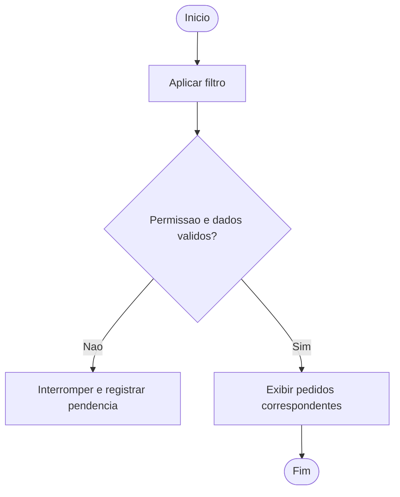
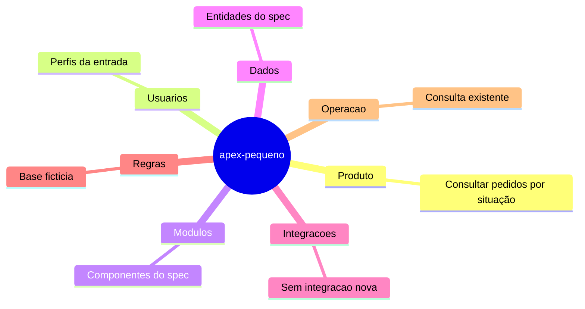

## Identificação e controle

Projeto apex-pequeno, fictício. Documento 1.0, formato 1.0, responsável pendente. Fontes/revisões no YAML.

## Resumo executivo

Problema: atendentes têm dificuldade de localizar pedidos por situação. MVP: filtrar a consulta existente; excluir alterações de cadastro. Prioridade alta pelo valor de localização, esforço relativo pequeno e dependência da consulta atual. Indicador: tempo de localização por tarefa; baseline e meta pendentes. Alternativa de nova página descartada como proposta por duplicar manutenção.

## Visão de produto

Síntese do MVP e valor acima; prioridades, métrica e alternativas em [spec](spec.md).

## Mapa funcional

FUN-01 — Consultar pedidos por situação. Origem: [REQ-01](spec.md); entradas/saídas e dependências ali descritas. Estado planejado.

## Visão de engenharia

APEX confirmado, versão pendente. Reutilizar consulta e convenções existentes após inspecionar exportação. Nenhuma migração ou integração nova. Autorização existente preservada e testada no servidor, sem inventar IDs de página. Fonte: [spec](spec.md).

## Dados e conceitos

Pedido e situação; somente leitura; ciclo de vida do cadastro preservado.

## Fluxos

**Fluxo de negócio proposto**, fonte [REQ-01](spec.md); não é fluxo de desenvolvimento.

Descrição textual: iniciar, aplicar filtro, verificar permissão e dados; inválidos interrompem com pendência, válidos seguem para exibir pedidos correspondentes e fim.

**Mapa mental**, fonte [produto/engenharia](spec.md).

Descrição textual: projeto organizado em produto, usuários, módulos, dados, integrações, regras e operação; os nós remetem aos conceitos do spec. Sintaxe/renderização: consultar relatório de avaliação, não presumir.

## Orientações para uso

PROC-01: objetivo e público conhecidos na entrada; pré-condição: acesso autorizado ao ambiente. Passos operacionais: pendentes de interface/exportação. Resultado esperado: REQ-01; exceções: permissões e dados inválidos. Estado: planejado, não validado; coletar evidência do sistema. Nenhum botão ou comando foi presumido.

## Falhas e suporte

Falhas relevantes e recuperação em [spec](spec.md). Mensagens e encaminhamento real pendentes; não inventar códigos.

## Operação

Consulta existente somente leitura; implantação segue processo ainda não fornecido. Recuperação de gravação N/A porque não há escrita nova.

## Governança

Base fictícia 1.0-ficticia, não é padrão real; [regras locais](projeto-regras.md). Gates não submetidos; nenhum aceite humano real.

## Estado do projeto

FUN-01 planejada. Implementação e verificação de negócio não executadas. Documentação conceitual candidata à revisão; manual validado pendente de execução e evidências.

## Índice documental

- [regras/empresa-processos.md](regras/empresa-processos.md) — revisão 1.0-ficticia.
- [regras/empresa-desenvolvimento.md](regras/empresa-desenvolvimento.md) — revisão 1.0-ficticia.
- [entrada.md](entrada.md) — revisão 1.0.
- [projeto-regras.md](projeto-regras.md) — revisão 1.0.
- [spec.md](spec.md) — revisão 1.0.

## Pendências documentais

Confirmar versões, padrões reais, aprovadores e interface. Sem material para manual validado. Histórico: 1.0 consolidação inicial fictícia, nenhuma aprovação atribuída.

